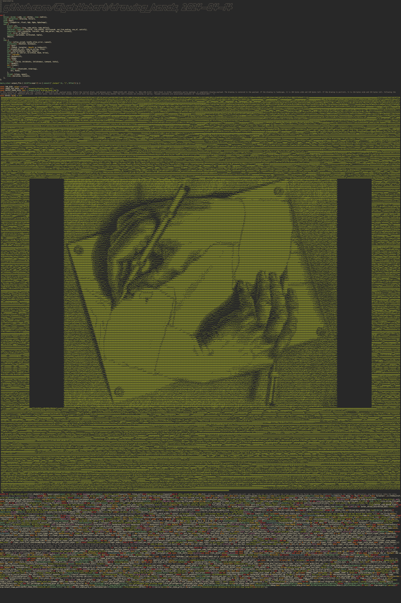

# `drawing_hands`

## Installation

1. Download the [Ubuntu Font Family](https://design.ubuntu.com/font).
2. Unzip the Ubuntu Font Family within the `assets/` directory so that `assets/ubuntu-font-family-0.83/UbuntuMono-R.ttf` is a valid path.
3. Install [`FIGlet`](http://www.figlet.org/). My command line prompted me with a variety of commands to use to install this package/executable.
4. Install [`vim`](https://www.vim.org/). I doubt you don't already have it installed.

## Execution

The easiest command to execute the full program is `cargo run -- -r`. I recommend reading the Explanation section for better context on the usage parameters.

### `main.rs`

**Usage:** `drawing_hands [OPTIONS]`

**Options:**

* `-f`, `--font-path <FONT_PATH>` (default: `./assets/ubuntu-font-family-0.83/UbuntuMono-R.ttf`). This works best as a mono-spaced font, where each character is as close to twice as tall as it is wide as possible. When encoding the font into the literal, each printable ASCII character of the font is converted into a 16x32 greyscale image, with 6 bits of luminance/alpha.
* `-i`, `--image-path <IMAGE_PATH>` (default: `./assets/Drawing_Hands_3x2.png`). The image to convert into ASCII art for the big literal.
* `-e`, `--example-name <EXAMPLE_NAME>` (default: `drawing_hands`). The output program will be created as `./examples/<EXAMPLE_NAME>.rs`.
* `-t`, `--tab-size <TAB_SIZE>` (default: `4`). This will be the tab size that `drawing_hands.rs` has in its `TAB_SIZE` constant, used to keep track of positions of non-whitespace text following tab characters.
* `-r`, `--run`. This automatically runs `drawing_hands.rs` after generating it.
* `-h`, `--help`. Print help.

### `drawing_hands.rs`

**Usage:** `drawing_hands [OPTIONS]`

**Options:**

* `-i`, `--input-text-path <INPUT_TEXT_PATH>` (default: `./examples/drawing_hands.rs`). The path to a text-based file to open up in `vim`.
* `-o`, `--output-image-path <OUTPUT_IMAGE_PATH>` (default: `./output/drawing_hands.jpg`). The output image file to produce.
* `-w`, `--min-pixel-width <MIN_PIXEL_WIDTH>` (default: `0`). The minimum pixel width of the output image file.
* `-h`, `--min-pixel-height <MIN_PIXEL_HEIGHT>` (default: `0`). The minimum pixel height of the output image file.
* `-t`, `--tab-size <TAB_SIZE>` (default: `4`). The tab size to use to keep track of positions of non-whitespace text following tab characters.
* `-d`, `--debug`. This will produce some debug files containing the (text, position), (text, color), and (text, position, color) ordered tuple lists.
* `-s`, `--skip-print`. Used in conjunction with `-d`, this will skip the image printing process. This is useful for iterating on code that's used to produce the list of (text, position, color) ordered trios.
* `--help`. Print help.

## Background

I wanted to create a piece of art that could, to some extent, encapsulate the beauty that I see in code.

I drew inspiration from a few works, including

* [Andy Sloane's "Donut math: how donut.c works"](https://www.a1k0n.net/2011/07/20/donut-math.html)
* [Yusuke Endoh's "Quine Relay"](https://github.com/mame/quine-relay)
* [M.C. Escher's "Drawing Hands"](https://en.wikipedia.org/wiki/Drawing_Hands), the namesake of this project.

## Explanation

This project consists of three programs, `main.rs`, `content.rs`, and `drawing_hands.rs`. Together, they can produce a file that can print an image of itself as rendered in `vim` at a resolution high enough for a 24"x32" poster.

### `main.rs`

`main` takes an input font `.ttf` file, an input image, and an output example name. Using the font data and the input image, `main` constructs a large `&[u8]` literal that encodes alpha bitmaps for printable ASCII characters, with a large ASCII-art representation of the input image in the center. It then combines this literal with the existing contents of `content.rs` to make the third program, which will carry the example name (`drawing_hands` by default). Inserted at the top of this third program is a signature of the project, produced by `FIGlet`.

### `content.rs`

`content` takes an input text path and an output image path. `content` opens up the input text file in `vim` to construct a list of (text, color) ordered pairs. By opening up the file itself and keeping track of whitespace characters, `content` also constructs a list of (text, position) ordered pairs. Due to some `vim` shenanigans, "zippering" these two lists is more difficult than one might think, but eventually content has a list of (text, color, position) ordered trios. With these, and the font alpha bitmaps decoded from the literal, `content` then outputs an image of the text file, colored as it would be in the user's `vim` settings. The key piece missing here is that if `content` tries to decode *its own* literal, it fails, as it's literal definition is just `const BYTES: &[u8] = br"";`. That's where the third program, `drawing_hands.rs`, comes in.

### `drawing_hands.rs`

With all the functional code of `content.rs`, albeit it condensed into a much less readable format, plus a valid `BYTES` literal, `drawing_hands` is actually capable of producing the image output that `content` wishes it could.

## Shortcomings

* My testing of this project leaves a lot to be desired. I'm sure there are some `vim` settings that make this fail in mysterious ways. I have tested removing `FIGlet` and verifying that the fallback text prints correctly.
* This is limited to printing files composed entirely of ASCII text.
